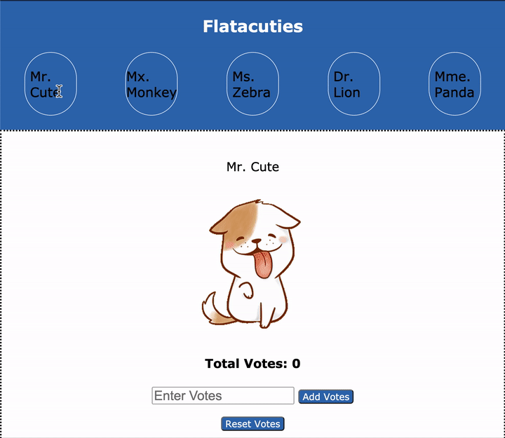

# Phase-1 Week 2 Code- Challenge
## Flactuaties
*An app for voting for the cutest animal using a local API (Json API), and fronrend development for the app (Flatacuties).*
### Demo
The demo.gif gives a sample of how the app should look like.

## Code Procedure
##### Run the code ```git clone git@github.com:John-Mwau/Phase-1-SA-03-Code-Challenge.git.```
###### Run ```npm install-g json-server``` to install json into directory.
##### Run ```json-server --watch db.json``` to see if the json database is functional.
##### Test your server by visting your browser via local port ```[http://localhost:3000/characters](http://localhost:3000/characters)```